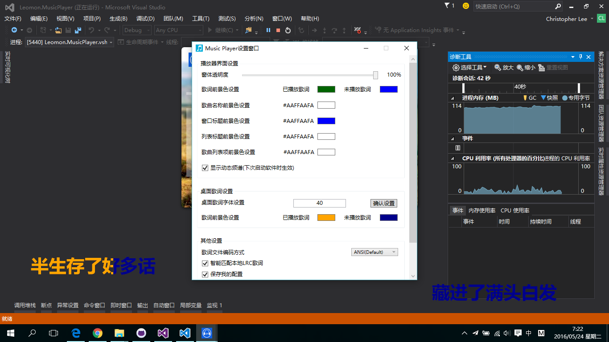

## WPF音乐播放器
--------------------------
### 说明
* 一款简单的个人音乐播放器，基于`WPF C# .Net Framework 4.0`开发；
* 开发环境：`Visual Studio 2013` ；
* 主要使用的第三方模块：
 - `DoubanFM.Bass.dll`
 - `Bass.Net.dll`
 - `bass.dll`
 - `WPFSoundVisualizationLib.dll`
* 播放器UI也是绞尽脑汁才想到的，之后花了很多功夫去完善。毕竟不是专业UI设计人员，所以不是很完美，希望你喜欢 :)
* 播放器在编写过程中，曾经遇到很多困难，但最终都克服了过来。期间参考了一些网友的设计理念，示例代码等，得到了很多帮助。但由于过去的的时间比较久了，不能一一列举出来，总之非常感激！

### 功能
#### 常规功能
- 支持常见音频文件播放，支持基本的播放控制模式：
 - 播放/暂停
 - 曲目切换
 
- 支持的播放模式：
 - 顺序播放
 - 列表循环
 - 随机播放
 - 单曲循环
 
- 支持歌词文件（仅`lrc`格式）加载及歌词显示功能：
 - 支持指定加载指定路径的歌词
 - 支持自动加载歌曲同名歌词文件
 - 支持播放器界面内滚动显示歌词和桌面歌词两种模式
 
- 支持从手动下载歌曲歌词功能
- 支持简单的歌曲搜索

#### 其他功能
- 支持播放器界面透明度修改功能
- 支持自定义背景图片功能
- 支持自动以放映模式播放指定目录中的图片
- 还支持一些其他功能，详细请自行测试，参见软件设置对话框
- 支持记忆播放、歌曲列表自动保存功能

### 演示截图
1. 
2. 
3. 

### 贡献
- 播放器编写完成后，在**[百度贴吧——C#吧](http://tieba.baidu.com/f?kw=c%23)**提供了下载链接，得到了一些网友的反馈，非常感激。

### 编译开发
